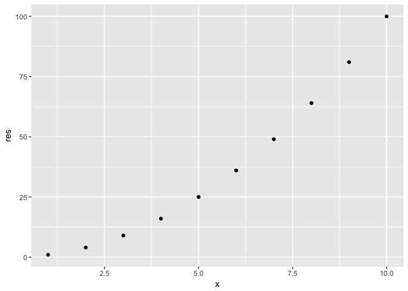
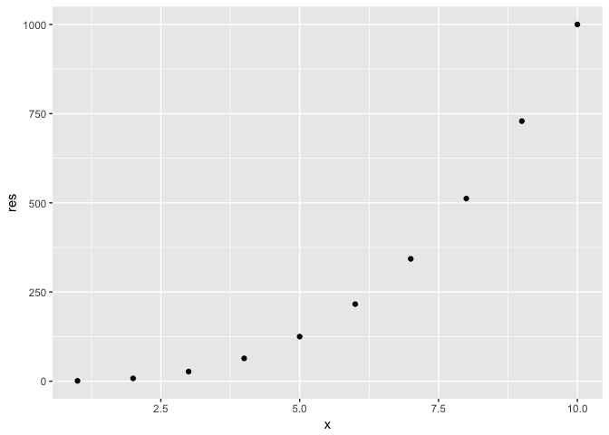
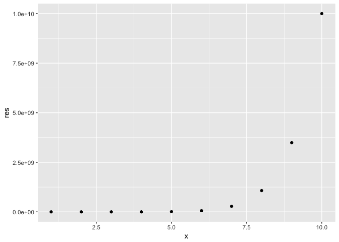
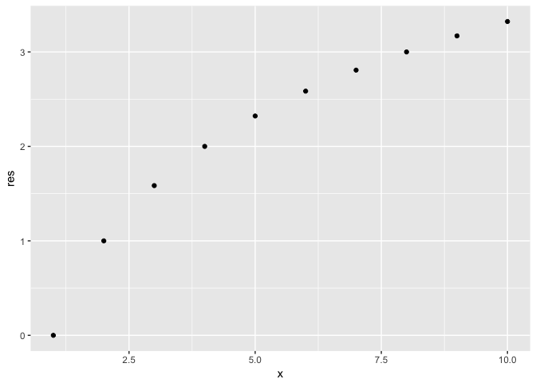
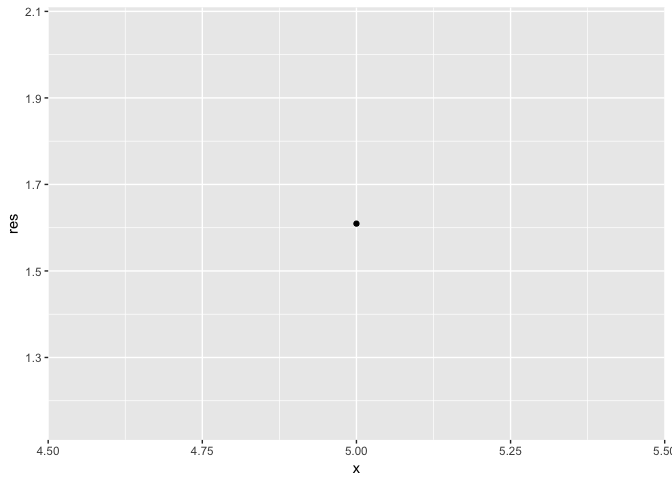

<!-- README.md is generated from README.Rmd. Please edit that file -->
`powers` package overview
=========================

This package contains functions that carry out power operations, log transformations, and conversion between Cartesian coordinates and polar coordinates.

Specific functions include:

-   `square` which squares a number or vector (i.e. raise to power of 2).

-   `cube` which cubes a number or vector (i.e. raise to power of 3).

-   `pow` which raises a number or vector to any power specified by the user.

-   `logarithm` log transforms a number or vector. The `base` of the log is specified by the user.

-   `polar_transform` converts two vectors in Cartesian coordinates into radius and angle, which specify the vectors' polar coordinates.

Installation
------------

You can install powers from github with:

``` r
devtools::install_github("suminwei2772/powers_package/tree/master/powers")
```

First let us load the package:

``` r
library(powers)
library(tidyverse)
#> Warning: package 'purrr' was built under R version 3.4.2
```

Using `square()`, `cube()`, and `pow()` functions
-------------------------------------------------

We will start off with some easy functions to see how the power operations are run.

``` r
square(1:10)
```



    #>  [1]   1   4   9  16  25  36  49  64  81 100
    cube(1:10)



    #>  [1]    1    8   27   64  125  216  343  512  729 1000
    pow(1:10, a=10)



    #>  [1]           1        1024       59049     1048576     9765625
    #>  [6]    60466176   282475249  1073741824  3486784401 10000000000

Using `logarithm()`
-------------------

This function takes a log of a vector. The base of the logarithm is specified by the user.

``` r
logarithm(1:10, base=2)
#> Warning in if (x < 0) {: the condition has length > 1 and only the first
#> element will be used
```



    #>  [1] 0.000000 1.000000 1.584963 2.000000 2.321928 2.584963 2.807355
    #>  [8] 3.000000 3.169925 3.321928
    logarithm(5, base=exp(1))



    #> [1] 1.609438

Using `polar_transform()`
-------------------------

This function transforms a vector in Cartesian coordinates into polar coordinates, as specified by `r` and `theta`.

-   `r` is the radius.
-   `theta` is the angle between the `(x,y)` and the x-axis.

``` r
polar_transform(1:10, 2:11)
#> [[1]]
#>  [1]  2.236068  3.605551  5.000000  6.403124  7.810250  9.219544 10.630146
#>  [8] 12.041595 13.453624 14.866069
#> 
#> [[2]]
#>  [1] 1.1071487 0.9827937 0.9272952 0.8960554 0.8760581 0.8621701 0.8519663
#>  [8] 0.8441540 0.8379812 0.8329813
polar_transform(5, 1)
#> [[1]]
#> [1] 5.09902
#> 
#> [[2]]
#> [1] 0.1973956
```
