Using the `powers` package
================
Lisa Wei
2017-11-27

This package contains functions that carry out power operations, log transformations, and conversion between Cartesian coordinates and polar coordinates.

Specific functions include:

-   `square` which squares a number or vector (i.e. raise to power of 2).

-   `cube` which cubes a number or vector (i.e. raise to power of 3).

-   `pow` which raises a number or vector to any power specified by the user.

-   `logarithm` log transforms a number or vector. The `base` of the log is specified by the user.

-   `polar_transform` converts two vectors in Cartesian coordinates into radius and angle, which specify the vectors' polar coordinates.

First let us load the package:

``` r
library(powers)
library(tidyverse)
```

    ## Warning: package 'purrr' was built under R version 3.4.2

Using `square()`, `cube()`, and `pow()` functions
-------------------------------------------------

We will start off with some easy functions to see how the power operations are run.

``` r
square(1:10)
```


    ##  [1]   1   4   9  16  25  36  49  64  81 100

``` r
cube(1:10)
```

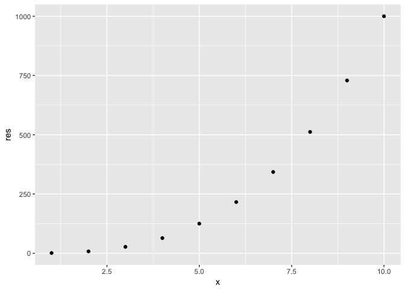

    ##  [1]    1    8   27   64  125  216  343  512  729 1000

``` r
pow(1:10, a=10)
```

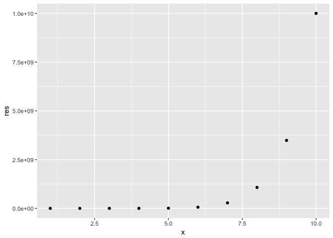

    ##  [1]           1        1024       59049     1048576     9765625
    ##  [6]    60466176   282475249  1073741824  3486784401 10000000000

The `square` and `cube` operations can be used with `apply` functions. In other words, functions in the `powers` package can operate on each number or vector in a list, sequentially.

``` r
my_list <- list(1:10, 0.5, -0.7)

## Operate on this list using square, cube, and pow

lapply(my_list, square)
```

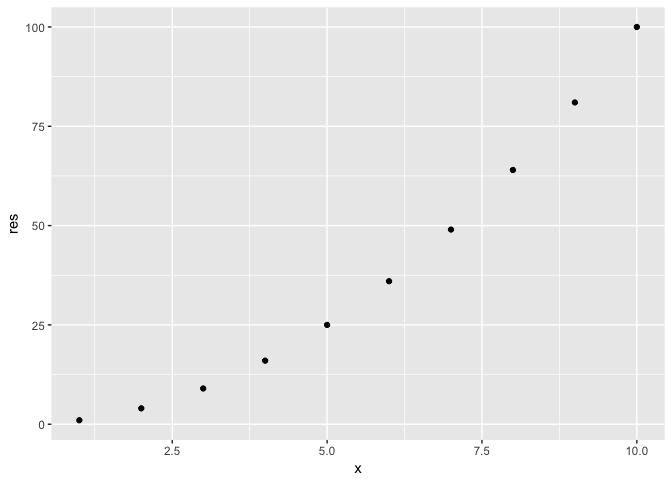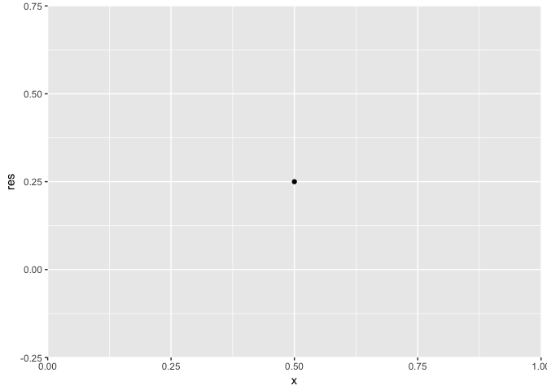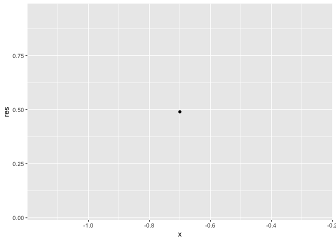

    ## [[1]]
    ##  [1]   1   4   9  16  25  36  49  64  81 100
    ## 
    ## [[2]]
    ## [1] 0.25
    ## 
    ## [[3]]
    ## [1] 0.49

``` r
lapply(my_list, cube)
```

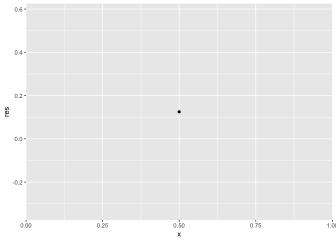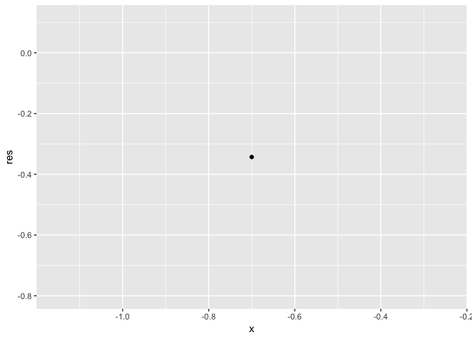

    ## [[1]]
    ##  [1]    1    8   27   64  125  216  343  512  729 1000
    ## 
    ## [[2]]
    ## [1] 0.125
    ## 
    ## [[3]]
    ## [1] -0.343

Let's try using `pow` and raise each element in the list to the power of `10`.

``` r
lapply(my_list, function(x){pow(x,a=10)})
```

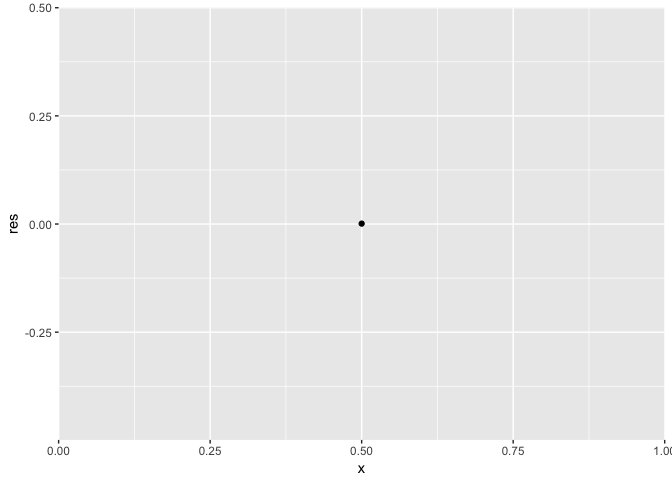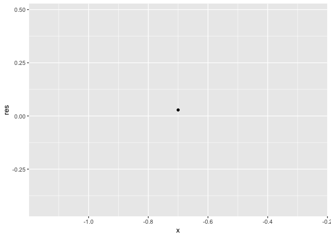

    ## [[1]]
    ##  [1]           1        1024       59049     1048576     9765625
    ##  [6]    60466176   282475249  1073741824  3486784401 10000000000
    ## 
    ## [[2]]
    ## [1] 0.0009765625
    ## 
    ## [[3]]
    ## [1] 0.02824752

Using `logarithm()`
-------------------

This function takes a log of a vector. The base of the logarithm is specified by the user.

``` r
logarithm(1:10, base=2)
```

    ## Warning in if (x < 0) {: the condition has length > 1 and only the first
    ## element will be used

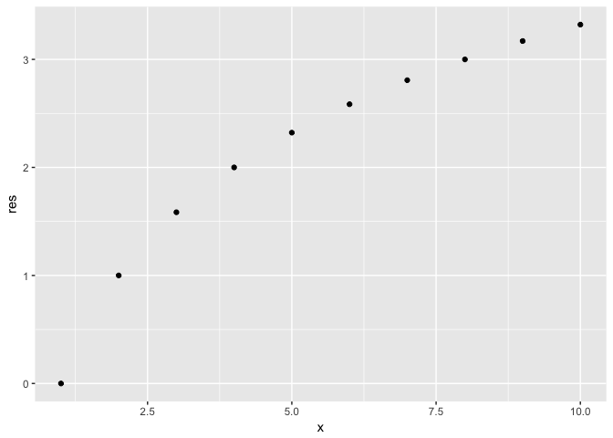

    ##  [1] 0.000000 1.000000 1.584963 2.000000 2.321928 2.584963 2.807355
    ##  [8] 3.000000 3.169925 3.321928

``` r
logarithm(5, base=exp(1))
```

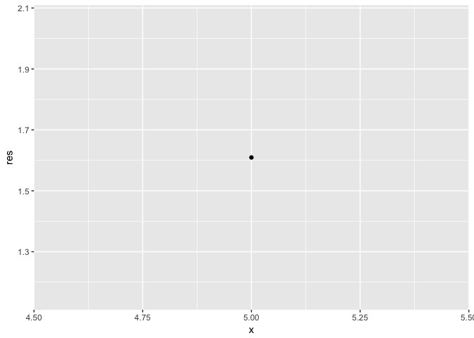

    ## [1] 1.609438

Using `polar_transform()`
-------------------------

This function transforms Cartesian coordinates into polar coordinates, as specified by `r` and `theta`. Output is a list.

-   `r` is the radius, given in the first element of the list output.
-   `theta` is the angle between the `(x, y)` and the x-axis, as provided in the second list of the output.

``` r
polar_transform(1:10, 2:11)
```

    ## $radius
    ##  [1]  2.236068  3.605551  5.000000  6.403124  7.810250  9.219544 10.630146
    ##  [8] 12.041595 13.453624 14.866069
    ## 
    ## $theta
    ##  [1] 1.1071487 0.9827937 0.9272952 0.8960554 0.8760581 0.8621701 0.8519663
    ##  [8] 0.8441540 0.8379812 0.8329813

``` r
polar_transform(5, 1)
```

    ## $radius
    ## [1] 5.09902
    ## 
    ## $theta
    ## [1] 0.1973956
